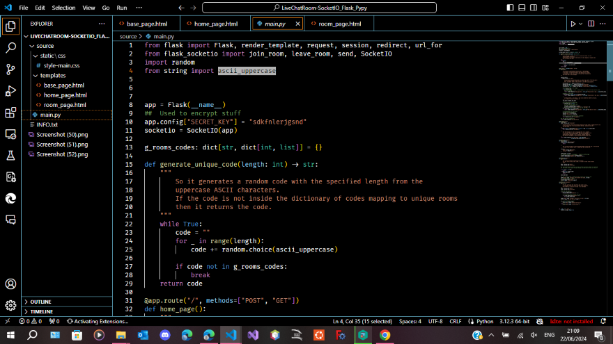
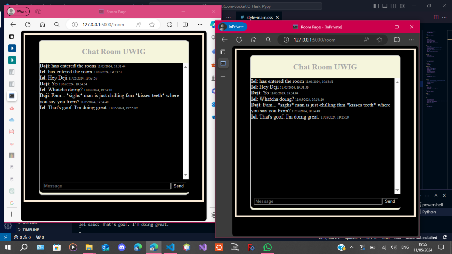
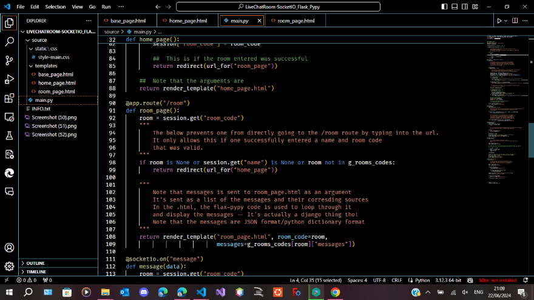
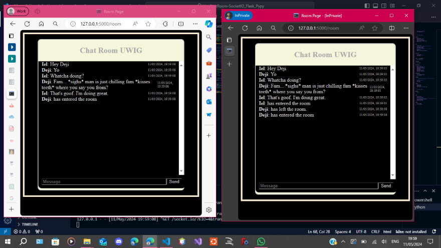
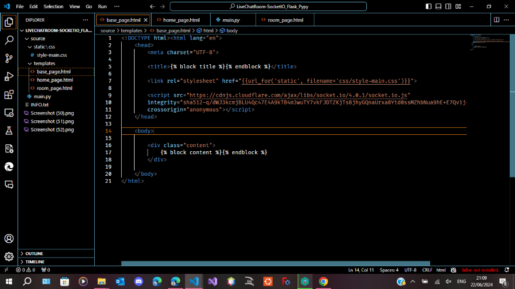
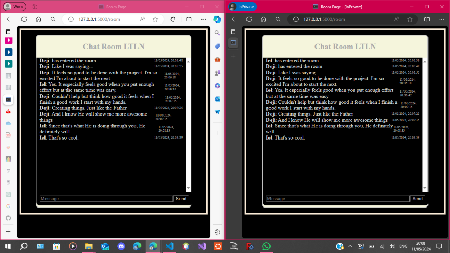
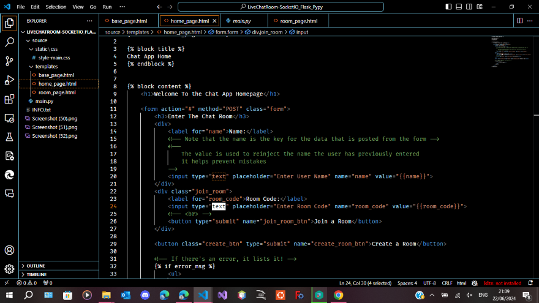
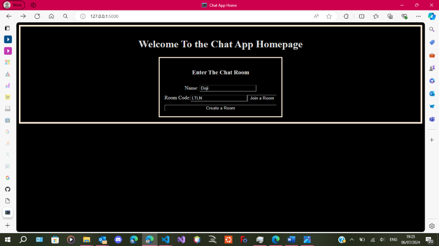

#	Real-Time Chatroom App Web Application Flask Python

##	About this Project

This project was done following the demonstration by Tech With Tim on Youtube.

"Python Live Chat Room Tutorial using Flask & SocketIO"

####	Requirements
pip install Flask
pip install Flask-socketio

Note that the socketio is not the normal Python sockets, but one by Flask, which is probably a wrapper
to help one integrate socketio with Flask apps!

Sockets enable live communication between apps with their own IP
It enables live message transmission.
A socket server running on the Flask web server will be used along with
clients, the web browsers that connect to the server.
The clients send messages to the server, which transmits the message to all clients in that server.
The server always listens for messages from the clients!

Finished: Sat-11-May-2024

flask-socketio DOCS:
https://flask-socketio.readthedocs.io/en/latest/getting_started.html

##	Screenshots

###	References
Tech With Tim, "Python Live Chat Room Tutorial using Flask & SocketIO", [Youtube], 2023
